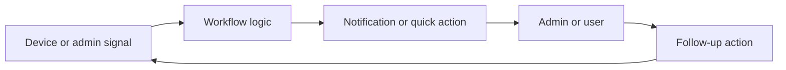

<!-- unified-readme:start -->
<div align="center">

# CompanyPortalSystemTrayTool

**A few weeks ago I released the Company Portal System Tray tool. The posts have a very good feedback and the tool was tested by some and also used productively. I have been working on developing the tool further and integrating more useful functions that can help with troubleshooting. The first version of the Company Portal system tray icon has many quick access possibilities to system tools or logs that are important for troubleshooting an Intune managed device. In addition, this tool has a quick access to open the Company Portal.**

Build. Automate. Share.

[](https://github.com/JayRHa/CompanyPortalSystemTrayTool/stargazers)
[](https://github.com/JayRHa/CompanyPortalSystemTrayTool/network/members)
[](https://github.com/JayRHa/CompanyPortalSystemTrayTool/issues)
[](https://github.com/JayRHa/CompanyPortalSystemTrayTool/graphs/contributors)

[Blog Post]()
<p align="left">
  <a href="https://twitter.com/jannik_reinhard">
    
  </a>
    <a href="https://github.com/JayRHa">
    
  </a>
</p>
In this blog I want to introduce the new version of the Tool.


---

`Endpoint Helper` | `PowerShell` | `Public` | `Maintained`

</div>

## What is this?

CompanyPortalSystemTrayTool helps endpoint administrators surface actions, alerts, or helper workflows closer to the device or admin process.

## Project Context

- Use it when endpoint state should trigger a visible notification, shortcut, or admin action.
- The project bridges local device context with management workflows.
- This repository is maintained as a practical project and reference asset.

## How It Works

Device or admin signals are collected, evaluated against the workflow logic, then surfaced as notifications, tray actions, or follow-up tasks.



## Quick Start

1. Review the project context and workflow below.
2. Clone the repository:

   ```bash
   git clone https://github.com/JayRHa/CompanyPortalSystemTrayTool.git
   ```

3. Continue with the setup, usage, or workflow sections below.

---
<!-- unified-readme:end -->

## Features
### Sync device


### Open Company Portal


### Open Quick Assist


### Troubleshoot


### System Info


### Change Password


